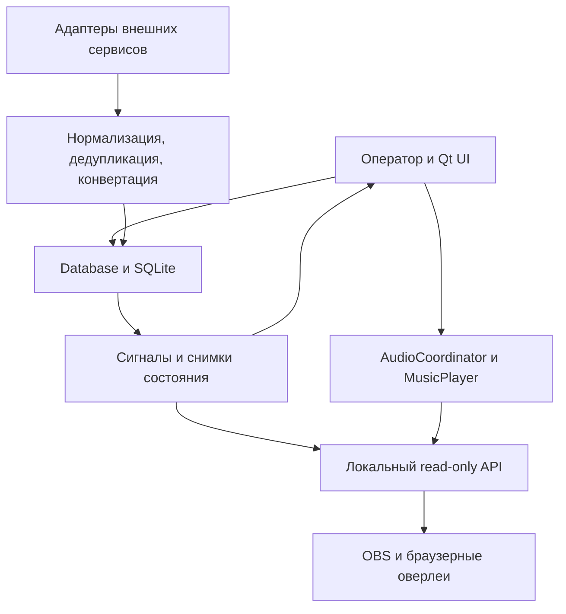

# InOneLine — главный документ разработки

Дата среза: **8 октября 2026 года**. Исходная ветка: `main`, коммит `89553afd215a710604211d2676ff9864e6128337`.

Документ объединяет состояние, архитектуру, требования, очередь работ и правила проверки. Он служит входной точкой для дальнейшей разработки. Подробные утверждённые контракты сохраняются в связанных канонических документах; исторические оригиналы не заменяются этим пересказом.

## 1. Полнота исходных данных

| Источник | Установленный состав | Результат |
|---|---|---|
| Google Drive «Программа для стриминга» | 395 файлов, 17 вложенных папок; 42 Google Docs, 123 текстовых файла, 168 ZIP, 48 PNG, 14 EXE | Все файлы получены; текст и содержимое архивов индексированы; изображения просмотрены; комментарии проверены для всех файлов |
| Комментарии Drive | 31 комментарий к четырём файлам, ответов нет | Сохранены с ID, датами и привязкой к документам |
| GitHub `ALL-EX-E/InOneLine` | 36 веток, 10 тегов, 1074 достижимых коммита, 149 файлов в исходном `main`; 30 PR и 3 самостоятельные задачи | Получена полная доступная Git-история, реестр веток, изменений, задач, PR, обсуждений и релизов |
| Чаты № 1–40 | Доступны фрагменты поиска и более поздние сводки | **Полные оригинальные экспорты не найдены. Полнота сообщений и решений не подтверждена** |
| Дополнительные вложения текущего запроса | 12 изображений и 12 видео | Сохранены отдельно; относятся преимущественно к настройке OBS/звука. Не являются доказательством реализации функций InOneLine |

Сплошная индексация, проверка CRC и статический анализ не равнозначны ручной смысловой проверке каждого исторического изменения. Этот аудит не объявляется окончательно закрытым: для полного выполнения исходного задания нужны оригинальные чаты № 1–40 и завершение проверки их соответствия документам. Доступность полного Git-архива также не означает, что все старые версии программы заново исполнены и проверены в Windows.

Числа выше относятся к источникам **до** добавления результатов этого аудита и новой рабочей ветки. Подробные результаты, ограничения и исправления: [отчёт аудита](audits/PROJECT_AUDIT_2026-10-08.md).

## 2. Как определять текущее состояние

Перед продолжением работы читать [рабочий журнал](ACTIVE_REVIEW_LEDGER.md), затем [состояние проекта](PROJECT_STATE.md), [дорожную карту](ROADMAP.md), [решения](DECISIONS.md), [реестр идей](IDEA_INVENTORY.md) и [правила работы](WORKFLOW.md).

С 30 сентября 2026 года GitHub — канонический источник кода, текущих решений и состояния. Drive — исторический и резервный архив. Слово `CURRENT` в имени старого файла не даёт ему приоритет. Более позднее прямое решение пользователя имеет приоритет над ранней сводкой ассистента, но утверждённая цель и уже реализованное поведение всегда учитываются отдельно.

| Объект | Состояние на дату среза |
|---|---|
| Версия приложения | `1.0.8` |
| SQLite | Схема `19`, 15 именованных миграций |
| Последний публичный maintenance-релиз | `v1.0.8-maintenance-2026-10-01`; это релиз до последующих принятых A4–A9 и P01–P04-C |
| Исходный `main` | Уже содержит принятые A4–A9, P01, P02, P03 и P04-A/B/C |
| P04-D / UI-007 | Ветка `candidate/p04-d-search-scope`, коммит `943a26d76bbaf0784b9e38fed84076d9597e82e3`, черновой PR #33; автоматические проверки прошли, ручная приёмка не подтверждена, в `main` не слит |
| Новая ветка аудита | `audit/2026-10-08-project-foundation`; изменения этого аудита предлагаются отдельно, без изменения принятого релиза |
| Drive `InOneLine_CURRENT.zip` | Побайтовая копия исходников **1.0.7**, SHA-256 `33e11f6590089d479eb9e9a64bde49dfef2858d4caefeab858a000a3e22ee20b`; исторический файл, не актуальная база разработки |

Не смешивать публичный релиз, принятый исходный код `main` и неприёмный кандидат. Одинаковый `APP_VERSION` не доказывает одинаковое содержимое. Для воспроизводимости использовать коммит, ID артефакта, имя файла, размер и SHA-256.

## 3. Назначение и реализованные возможности

InOneLine — настольная программа Windows для ведения списка, проведения аукционов и колеса, обработки внешних событий и вывода данных в OBS. Авторитетные данные и бизнес-состояние находятся в приложении и SQLite; браузерные оверлеи отображают это состояние.

| Область | Реализовано в исходном `main` |
|---|---|
| Список | Добавление, изменение, статусы, баллы, даты, кооператив, отзывы, архивирование/восстановление, поиск, фильтры, безопасная очистка |
| Публичный список | Представление общих данных, синхронизация, файловый экспорт и локальный read-only JSON API; экспорт пока размещён в настройках |
| Импорт и XLSX | CSV с проверкой до применения и совместимыми заголовками, публичная/общая таблицы XLSX, контроль изменений и синхронизация |
| Аукцион | Постоянные и временные лоты, ставки/вклады, журнал действий, режимы максимальной суммы и колеса, старт/пауза/продолжение/остановка, завершённая история |
| Автопродление | Общая обработка смены лидера, нового временного лота и внешнего события; одно действие продлевает один раз на максимум применимых длительностей, с порогом |
| Колесо | Взвешенный выбор, локальная/OBS-анимация, восстановление состояния, проверочный снимок результата, варианты источников случайности |
| Выбывание D21 | Каждый раунд — настоящий взвешенный выбор; явное архивирование выбывшего лота; последний лот тоже проходит раунд; после нуля лотов нет автоматического финального победителя |
| Центр колеса D19 | Управляемые локальные/внешние изображения, поддерживаемая анимация, общий выбор через настройки и быстрый диалог, каталоги Twitch/7TV/BTTV/FFZ |
| Правила | Шаблоны, форматированный текст, локальный просмотр, снимок правил сессии, отдельный read-only OBS viewer |
| OBS | Основной оверлей, список, лоты аукциона, колесо, правила, таймер и музыкальный плеер; URL/предпросмотр, настройки внешнего вида, проверка версии страницы |
| Музыка D26/D43 | Библиотека MP3/WAV/OGG, порядок/случайный порядок, позиции, обложки, отдельный OBS-плеер и спектр; общий саундтрек аукциона/колеса и согласованная передача владения звуком |
| Интеграции | Общие соединения и возможности провайдеров, Twitch и DonationAlerts, защищённые credentials, фоновые операции, дедупликация событий, исходные единицы и конвертация |
| Резервирование | SQLite backup, полная `.iolbackup`, предварительная проверка, staging, safety backup и откат при неудачном восстановлении, совместимость старых архивов |
| Windows и поставка | PyInstaller/Inno Setup, один экземпляр программы, app-owned `ui_state.ini`, безопасная миграция HKCU, неизменяемые запросы публикации и проверка принятых байтов |
| Принятые P01–P04-C | Один F5 и удалённые меню, нейтральные подписи, совместимые CSV-заголовки и исправление каретки даты, постоянно видимые таблицы, отсутствие неявного выбора первой строки, снятие выбора по пустой области |

Для столбцов и сортировки сохраняется общий порядок: `ПРОХОДИТСЯ` → `ИГРАЛ + НЕ ИГРАЛ` → `ПРОЙДЕНО` → `ЗАБРОШЕНО`; архив учитывается по действующей общей SQL-политике. Статусы `ИГРАЛ / НЕ ИГРАЛ` защищены от механических переименований.

## 4. Архитектура

### 4.1 Модули и ответственность

| Путь | Ответственность |
|---|---|
| `app.py` | Запуск, ранние Windows-проверки, frozen backup/restore, один экземпляр, настройка Qt и обработка аварий запуска |
| `streaming_manager/views/main_window.py` | Сборка зависимостей, вкладки, сигналы обновления, пул фоновых задач, API, музыка и интеграции |
| `streaming_manager/ui.py`, `views/__init__.py` | Совместимые фасады импортов; отсутствие внутренних прямых вызовов само по себе не доказывает ненужность реэкспорта |
| `streaming_manager/views/` | Qt-интерфейс списков, аукциона, истории, OBS, музыки, правил, настроек и проверки победителя |
| `views/auction_parts/` | Части существующего AuctionTab: действия, состояние, поиск, RNG и аудио; сохраняют один общий процесс аукциона |
| `streaming_manager/database.py` | Фасад Database, объединяющий специализированные миксины |
| `streaming_manager/db/` | Схема/миграции, списки, сессии, ставки, внешние события, конвертация, медиа, правила, колесо и история |
| `integrations.py`, `twitch*.py`, `donationalerts*.py` | Реестр/адаптеры, авторизация, приём событий и жизненный цикл провайдеров |
| `conversion.py` | Нормализация единиц, Decimal, положительные курсы и округление положительной дроби вверх |
| `credentials.py`, `diagnostic_logs.py` | DPAPI-хранилище Windows вне SQLite, очистка секретов в диагностике |
| `audio.py`, `music_player.py` | Единый AudioCoordinator и авторитетное состояние музыкального плеера |
| `media.py`, `db/media.py`, `wheel_center_media.py`, `remote_image.py` | Управляемые файлы, внешние ссылки, доступность, импорт и защищённая выдача медиа |
| `random_sources.py`, `wheel_motion.py`, `db/wheel.py` | Источники случайности, отображение движения и сохранение проверочного снимка |
| `api_server.py`, `web/` | Локальный HTTP read-only сервер и браузерные представления |
| `backup_restore.py`, `app_paths.py`, `ui_settings.py` | Размещение данных, полное/SQLite резервирование, восстановление, UI-state и миграция |
| `exporters.py`, `public_xlsx.py`, `shared_xlsx.py` | Существующие файловые экспорты и XLSX-интеграция |
| `tools/`, `installer/`, `.github/` | Регрессии, исходный снимок, сборка, установка и публикация |

### 4.2 Потоки данных

Запись бизнес-данных проходит через существующие транзакционные методы Database. После записи обновляются затронутые List/Public/Auction/Journal и OBS/API без обязательного ручного F5. Рабочие потоки не обращаются к Qt-виджетам как к потокобезопасным объектам. HTTP получает безопасные снимки музыкального состояния; сетевые/авторизационные операции выполняются вне GUI.

### 4.3 Данные и миграции

| Таблицы | Назначение |
|---|---|
| `games` | Постоянные записи и временные `auction_only`-лоты |
| `auction_sessions`, `auction_entries`, `contributions` | Сессии, состав/снимки лотов и происхождение начислений |
| `external_events`, `pending_conversions` | Внешнее событие, дедупликация, статус применения и неизвестный курс |
| `integration_connections` | Настройка/состояние соединения и последняя активность, ссылки на защищённые credentials |
| `conversion_units`, `settings` | Исходные единицы, курсы и существующие настройки |
| `media_assets` | Общий реестр управляемых файлов и внешних ссылок |
| `auction_rule_templates` | Шаблоны правил |
| `wheel_verification_snapshots`, `wheel_verification_participants` | Неизменяемые по контракту снимки результата/участников для read-only replay |
| `change_log` | Аудируемая история действий |
| `schema_meta`, `schema_migrations` | Версия схемы и выполненные именованные миграции |

Миграция — отдельное осознанное изменение со сценарием обновления и отката; этот аудит не меняет схему. SQLite FK и атомарность защищают связи. В истории сохраняются первоначальная единица/сумма, применённый курс и итоговые баллы; новый курс не пересчитывает уже принятые вклады.

### 4.4 Локальный API и OBS

По умолчанию сервер привязан к `127.0.0.1:8765`. API не предоставляет новый общий интерфейс записи лотов. Существующие legacy aliases сохраняются до отдельного решения о совместимости.

| Канонический маршрут | Данные/представление |
|---|---|
| `/api/health` | Версия и доступность |
| `/api/data`, `/api/public`, `/api/auction-export` | Основной снимок, публичный список, совместимый аукционный экспорт |
| `/api/wheel`, `/api/auction-lots`, `/api/timer` | Авторитетные снимки колеса, лотов и таймера |
| `/api/rules`, `/api/music-player` | Правила и музыкальный плеер |
| `/overlay`, `/list-overlay`, `/auction-lots-overlay`, `/wheel-overlay` | Основные браузерные оверлеи |
| `/rules-overlay`, `/timer-overlay`, `/music-player-overlay` | Правила, таймер/саундтрек, музыкальный плеер |
| `/media/<id>`, `/music-cover/<id>` | Зарегистрированные медиа и обложки; не произвольные пользовательские пути |

Оверлей — renderer/transport: не второй таймер, RNG, процесс аукциона или источник записей. OBS отвечает за композицию сцены и viewport. Повторное открытие музыкального/таймерного Browser Source синхронизируется с текущей позицией приложения. Предпросмотр не создаёт второй слышимый плеер. Проверка версии использует уже существующие запросы страницы.

### 4.5 Аукцион, RNG, время и интеграции

Обычное взвешенное колесо определяет результат до анимации; анимация не выбирает победителя повторно. Снимок содержит участников, веса/шансы, диапазон и fallback, случайное значение, метод/версию алгоритма, результат и время; Random.org+ сохраняет доступные доказательства. Хеш только внутри той же изменяемой БД не считается защитой от намеренной подделки — независимая подпись отложена.

Приём внешнего события использует общую пару «сервис + внешний ID» и исходное время провайдера. Допустимое событие вне аукциона может изменить постоянную запись, но не создавать/запускать аукцион, таймер или колесо. Неизвестный пригодный заголовок вне аукциона создаёт постоянную запись в общей транзакции; во время приёма ставок — временный лот. Неизвестный курс остаётся в очереди. Текущий дефект пустого заголовка и утверждённый будущий `Без текста N` описаны в разделе 7.

Автопродление применяется один раз к одному принятому действию/событию, по максимальной подходящей причине. Равенство порогу допускается; завершённый/истёкший/приостановленный таймер не возрождается. Требование общей границы старта после ~1,2 секунды подготовки — **будущая цель P16**, а не уже принятый результат текущего кода.

### 4.6 Аудио, медиа, секреты и восстановление

AudioCoordinator выбирает одного слышимого владельца. Доступный незаглушённый саундтрек аукциона/колеса временно приостанавливает музыкальный плеер с точной позицией; завершение звуковой фазы возвращает плеер до подтверждения победителя. Перезапуск восстанавливает трек/позицию в Pause, без автозапуска.

Управляемая музыка находится в `data/music`, саундтрек — в общей `data/soundtrack`. Внешние ссылки не дают права менять или удалять оригинал; полная копия не включает произвольные внешние файлы. Для совпадений используются существующие варианты «использовать существующий / заменить / отдельная копия / отменить», доступность проверяется общей библиотекой.

Windows-токены хранятся как DPAPI ciphertext в `data/credentials`; SQLite содержит непрозрачные ссылки. Обычные настройки, логи, экспорт и manifest не содержат открытых секретов. Вне Windows тестовый backend непостоянный. «Отключить использование» сохраняет настройки/credentials/историю; «Удалить подключение» после подтверждения удаляет локальное подключение, но не историю событий.

Восстановление сначала проверяет исходник, затем отдельный staging, создаёт safety backup и при ошибке возвращает исходные данные. Удаление неиспользуемой переменной не должно удалить сам вызов проверки. Настройки окна принадлежат приложению; HKCU мигрируется с резервом обеих разрядностей и очисткой только после успешного переноса.

## 5. Структура разработки и материалов

| Путь | Что хранить |
|---|---|
| `app.py`, `streaming_manager/` | Исполняемый код; сохранять действующие фасады и module paths |
| `installer/`, `requirements*.txt` | Сборка/установка и зависимости |
| `tools/` | Постоянные регрессии и инструменты публикации/исходного снимка |
| `assets/`, отслеживаемые файлы `data/` | Штатные ресурсы; не пользовательские базы/секреты |
| `docs/MASTER_DEVELOPMENT.md` | Единая входная карта разработки |
| `docs/ACTIVE_REVIEW_LEDGER.md` | Текущие UI/BUG-контракты и приёмка |
| `docs/PROJECT_STATE.md`, `ROADMAP.md`, `DECISIONS.md`, `WORKFLOW.md`, `IDEA_INVENTORY.md` | Состояние, очередь, правила и полный исторический реестр идей |
| `docs/audits/` | Датированные отчёты и журнал проверенных исправлений |
| `docs/qa/` | Кандидаты, ручные сценарии, результаты и привязки артефактов |
| `docs/history/`, Git history | Исторические решения; не вторая текущая дорожная карта |
| `.github/workflows/`, `.github/release/requests/` | CI и неизменяемые запросы публикации |
| GitHub Releases | Официальные installer/source; не изменять уже опубликованные байты |

Drive сохраняет три существующие категории: «Сама программа», «Текстовый лог», «Скриншоты». Внутри сборок выделяются официальные релизы, откаты, кандидаты и подтверждённые дополнительные копии. В текстовом архиве сохраняются история состояния, старые сверки и специализированные требования. В отдельной папке обзора на Drive создан [путеводитель по архиву](https://docs.google.com/document/d/1kOFeUp1pDN-V8XkUEu424wwU-DAiFa0lAIg-6UoY5dM/edit), содержащий назначение категорий и ссылки на канонические документы. Полные приватные реестры отдельных файлов, SHA-256 и журнал перемещений не следует считать опубликованными в этой папке; их полноту и местонахождение необходимо проверять отдельно. Подробные результаты сводятся в датированном отчёте аудита.

Исходные файлы, ID, комментарии и связи не уничтожаются. Совпадение текста не равно совпадению Google Doc: могут отличаться оформление, комментарии и контекст. Полное совпадение SHA-256 подтверждает одинаковые байты, но не отменяет самостоятельную роль «релиз / откат / кандидат». Совпадающее содержимое ZIP с другой упаковкой также не даёт права переписывать принятый артефакт.

## 6. Очередь развития

### 6.1 Текущий пакет интерфейсных исправлений

| Пакет | Содержание | Состояние |
|---|---|---|
| P00 | Базовые проверки принятой версии | Пройден |
| P01 | Оболочка MainWindow, меню и один F5 | Принят и слит |
| P02 | Подписи List/Public, диалоги, безопасная очистка | Принят и слит |
| P03 | CSV, ошибки импорта и каретка даты | Принят и слит |
| P04-A/B/C | Постоянная видимость списков, выбор/снятие выбора | Приняты и слиты |
| P04-D | UI-007: поиск во всех обычных записях с архивом, временные лоты исключены; очистка возвращает выбранный фильтр | Автоматический PASS, ожидает ручной приёмки #33 |
| Остаток P04 | UI-008/009/028/076: остальные контракты поиска/Enter и сумма баллов через общий снимок | Не закрыт |
| P05 | CSV/JSON/XLSX на Public, удалить внутренний Settings Export | Утверждённая цель, не реализован |
| P06 | Малый размер окна, прокрутка, совместимая смена порядка вкладок, backup `ui_state.ini` | Утверждённая цель, не реализован |
| P07 | Одна политика позиций и derived read-only позиция XLSX | Утверждённая цель, не реализован |
| P08 | Общая идентичность/дедупликация и доступность медиа | Утверждённая цель, не реализован |
| P09 | Структура Stream/OBS, убрать операторский API-блок с сохранением endpoints | Утверждённая цель, не реализован |
| P10 | Общий режим показа OBS, таймер/музыка и единая помощь по звуку | Утверждённая цель, не реализован |
| P11 | Единый составной шаблон правил: текст и оформление | Утверждённая цель, не реализован |
| P12 | Единая страница аукциона и один список лотов, поиск | Утверждённая цель, не реализован |
| P13 | Контекстный блок таймера/аудио, компоновка и быстрый preview | Утверждённая цель, не реализован |
| P14 | Оверлей лотов, только OBS-автопрокрутка с сохранением, итоговая сумма | Утверждённая цель, не реализован |
| P15 | OBS-блок колеса, оформление/центр, лот под стрелкой UI-079/D42 | Утверждённая цель, не реализован |
| P16 | Единая длительность 1 с…24 ч, восстановление после прерывания, tie default Max Amount, общий старт после подготовки | Утверждённая цель, не реализован |
| P17 | Настройки аукциона поверх итоговой политики времени/колеса | Утверждённая цель, не реализован |
| P18 | Общая модель подключения/готовности провайдеров и навигация RNG | Утверждённая цель, не реализован |
| P19 | Атомарные курсы, очередь, явные Apply/«Не применять», защита черновика | Утверждённая цель, не реализован |
| P20 | Итоговая машина состояний Max Amount/Wheel | Утверждённая цель, не реализован |
| P21 | Ограничение по исходному времени события, очередь сессии, `Без текста N` | Утверждённая цель, не реализован |
| P22 | Прозрачность интеграций и итоговый History/Journal | Утверждённая цель, не реализован |
| Финальная проверка | Автоматическая и ручная регрессия, приёмка и публикация точных байтов | После завершения выбранных пакетов |

UI-001…UI-090 распределены каноническим журналом. UI-014/016/017/018/023/026/027/031/044/057 — сохранение/проверка/поглощённые цели. GLOBAL-FOCUS-001 остаётся отдельной отложенной общей проблемой: при заполненной таблице нет пустого места для снятия выбора, нужен единый безопасный жест после отдельного UI-review.

Зависимости: общие позиции P07, медиа P08 и режим показа P10 предшествуют зависимым оверлеям; единая страница P12 предшествует компоновке; таймер P16 предшествует настройкам P17; очередь/конвертация P19 предшествует source-time и пустым сообщениям P21. Изменения этого аудита не закрывают эти будущие пакеты.

### 6.2 Сохранённые будущие функции

После текущего пакета сохраняется историческая цепочка: D40 → D34 → D41 → кандидат интеграции YouTube → D38 → Public Web → D27 → D7. Это порядок зависимостей/обсуждения, а не разрешение начать всё сразу.

| Идентификаторы | Содержание и ограничения |
|---|---|
| Global Multi-File Import / #4 | Общий Ctrl/Shift multi-select через действующий механизм музыкального импорта; доступен для выбора, автоматически не выбран |
| D40 | Ручной порядок библиотеки; не возвращает старый аукционный playlist |
| D34 | Адаптер Tourniquet после свежей проверки официального API, надёжности, безопасности и событий |
| D41 | Межплатформенный чат и отдельный OBS viewer; обычный чат не меняет баллы/аукцион |
| D38, Public Web | Отдельная сетевая/публичная архитектура и безопасность; текущий localhost не раскрывается автоматически |
| D27, D7 | Физическое колесо как отдельная альтернатива; полная подписанная/независимая проверка результата |
| D23, D24, D25 | Импорт участников с preview/merge, отдельный OBS-список участников, накопленная вероятность по проверочному снимку |
| D1, D2 | Двойной таймер и закрепление лота; отложены |
| D5 | Аналитика History после завершения/интеграций: календарь, дни недели, участники, единицы, рекорды; стабильный provider user ID и сопоставимые валюты |
| D9–D12 | Локализация и только официальные ссылки проекта/поддержки |
| D13, D31 | Будущая ручная очередь и Never/Match/Always; не меняют действующий автоматический приём |
| D28–D30, D32–D33 | Отдельные режимы шансов, имён, скрытых сумм и сортировки; viewer presentation не меняет авторитетные суммы/RNG |
| D35–D37 | Множитель отдельной ставки, зависимый выбор зрителем, presets с версионированием и защитой секретов |
| D16–D18, D20, D22 | Hover, случайная длительность, стили, разбиение сектора, Battle Royale — явно отложены, не отклонены |
| W1, Saved/New Auction, Product A8 | Hotkey, сценарии сохранённых аукционов, аудируемая компенсация Undo — отдельные отложенные контракты |
| Будущие сервисы | Kick/VK rewards, другие donation adapters и B6 — только после проверки реальных API/auth/capabilities, через общий backend |

D3 не утверждён к реализации; D15 не подтверждён как задача этого проекта; D39 — предложение ассистента. Старые D4/D6/D8/D14, отклонённые F-пункты, трейлер и автопрокрутка общего списка не возвращаются автоматически. Compact оставлен до реальной необходимости. Полные формулировки и ранняя история: [IDEA_INVENTORY](IDEA_INVENTORY.md).

Идентификаторы A обязательно снабжать пространством: «August Stabilization A1–A12/A7.1/A11.1», «Product A1–A8/A6.1», «Maintenance A1–A10». Одинаковые номера в этих пространствах обозначают разные работы.

## 7. Известные проблемы и технический долг

| Пункт | Состояние/следующее действие |
|---|---|
| QA-1.0.8-01 | В аукционном компактном статусе нет времени последнего события; поле уже есть в БД/Settings. Нужен локальный вывод существующего поля |
| QA-1.0.8-02 | Общая нормализованная модель не представляет test/sandbox/demo-gate. Контракт принят; воспроизведение на текущем поддерживаемом провайдере не установлено. Требуются реальный payload и проверка capabilities |
| QA-1.0.8-03 / UI-087 | Пустой заголовок сейчас `inapplicable`; будущая цель — отдельный временный `Без текста N` и сохранение pending при неизвестном курсе, а не общий ручной bind |
| GLOBAL-FOCUS-001 | Единое снятие focus/selection без поиска пустого места, с сохранением Enter, двойного клика, клавиатуры и валидации |
| Таймер/OBS/пустые сообщения | Утверждённые цели P16/P21 ещё не реализованы; не выдавать их за текущие функции |
| Валидация скрытых настроек | В текущем `save_auction_settings()` выключенный и скрытый неверный интервал блокирует сохранение; подтверждённое исправление предлагается веткой аудита |
| Ложный PASS CI | Последняя успешная Python-команда могла скрыть предыдущий сбой; исправляется контроль каждого завершения и отрицательная проверка |
| Тест отката | Не проверял достижение точки внедрённого сбоя; добавляется явная проверка, чтобы ранний иной сбой не считался проверкой частичного отката |
| Сложность | Большие Auction/Settings/GUI-smoke модули, динамические Qt-сигналы и миксины осложняют доказательство ненужности кода; крупный рефакторинг не выбран |
| Архивы и документация | Старые cumulative-тексты повторяют версии и содержат устаревшие CURRENT. Сохранять источник/дату и пользоваться актуальной картой |
| Оригиналы чатов и ранних ссылок | Полные чаты 1–40 отсутствуют; поздняя реконструкция не заменяет оригинальные сообщения/изображения |

Совместимые реэкспорты, Twitch shims и настраиваемый DonationAlerts fallback не удаляются по отсутствию прямых вызовов в обычной поставке. Ветка, недостижимая при стандартном Client ID, может быть достижима при поддерживаемом внедрении адаптера. Удаление требует анализа параметров, динамических вызовов, сигналов и реального теста.

## 8. Конвенции и критерии готовности

- Python с существующими type hints, dataclass/фасадами и именами модулей; стиль соседнего кода, небольшой локальный diff. Не переименовывать DB/API/legacy identifiers ради видимых подписей.
- Сначала переиспользовать существующий helper, state, транзакцию, библиотеку медиа и сигнал обновления. Новый backend/state — только при доказанной необходимости.
- Сначала проверить и нормализовать вход, затем атомарно записать. SQL-значения передаются параметрами. Денежные/сервисные значения — Decimal и единое округление, не отдельная float-формула провайдера.
- GUI не блокируется сетью/длительной файловой работой. Кнопка применима, но временно недоступна — видимая disabled; неприменима по смыслу — скрывается с зависимой строкой.
- Ошибки понятны оператору, содержат контекст/способ исправления и не раскрывают секреты. Журнал сохраняет происхождение события/изменения.
- Изменение RNG, таймера, миграции, ownership или внешнего интерфейса требует собственной проверки контрактов. Удалять только доказанно ненужное; совместимость не считать мусором.
- Использовать постоянные `tools/*_smoke.py`, compile, проверки БД, нужные отрицательные сценарии и Windows regression. Linux offscreen PASS не заменяет Windows/OBS/DPAPI/звук.
- Проверять код возврата каждой существенной native-команды CI сразу; успешный следующий тест не должен маскировать ошибку предыдущего.
- Для изменения вести проблему, доказательство, изменённые пути, тесты и ограничения в `docs/audits/`/`docs/qa/`. После решения обновлять каноническое состояние и этот документ; не дописывать вторую независимую текущую очередь.
- Кандидат не равен релизу. Ручной чек-лист предоставляется целиком; уже подтверждённые сценарии не повторяются без причины. Публикация использует точно принятые bytes и новый неизменяемый request, не пересборку/перезапись старого tag.
- Не публиковать частные базы, токены, личные метаданные и внутренние design-reference материалы. Публичная документация проходит `publication-wording`.

## 9. Следующая работа и недостающие сведения

1. Получить оригинальные экспорты каждого чата № 1–40 со всеми сообщениями/вложениями и стабильной нумерацией; заполнить матрицу покрытия и проверить решения, которые сохранились только в сводках.
2. Windows regression CI для ветки аудита на коммите `46f2124da23d6884374de8dd064595dfa75c96b0` завершился SUCCESS ([run 37729267605](https://github.com/ALL-EX-E/InOneLine/actions/runs/37729267605)); wording gate — SUCCESS. Дальше требуется отдельная ручная приёмка скрытых интервалов на Windows. До неё изменения остаются кандидатами.
3. Завершить ручную приёмку P04-D #33 отдельно; не считать её выполненной этим аудитом.
4. Для QA-1.0.8-02 получить воспроизводимый test-event payload текущего провайдера; для GLOBAL-FOCUS-001 отдельно выбрать жест и проверить Qt-поведение.
5. Продолжать утверждённые небольшие пакеты с сохранением их зависимостей, истории и точных артефактов.

Полный исходный запрос остаётся открытым в части недоступных оригинальных чатов и доказательства полного смыслового покрытия истории. Сводный документ и проверяемые исправления готовы как основа для продолжения этой работы.
